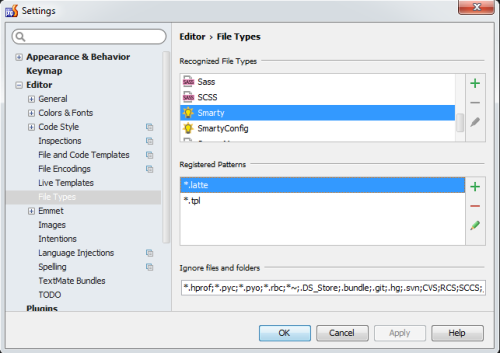
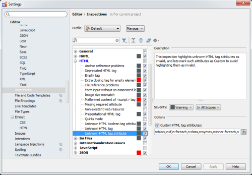

Template Latte Replace
================

[Nette Latte](https://latte.nette.org/) template engine support for [ProcessWire CMS](http://processwire.com/).


## Links

- [Modules Directory](http://modules.processwire.com/modules/template-latte-replace/)

- [ProcessWire forum topic](https://processwire.com/talk/topic/13168-module-template-latte-replace/)


## Install

1. Install the module

1. Create a "views" directory in "/site/templates/" directory

1. Create a main layout file in the "views" directory, eg. "@layout.latte".

1. For each of your template php files, create a view file in the "views" directory. For example, create "views/basic-page.latte" for "basic-page.php"

*Note: you can customize view files' directory, $view variable name and main layout in module settings, see below.*

## Uninstall

Simply uninstall the module through the admin.

Note that uninstalling the module will cause an existing site disfunctional because all content is printed through the view files.

## Usage

Template php files will serve as controllers which load the identically named view (.latte) files.

These "controllers" provide data for view files through a $view object.

*Example: pass $subPages to view file and loop through it. In the view file `$view->subPages` become `$subPages`*.

```php
// home.php
$view->subPages = $pages->get(1)->children();
```

In "views/home.latte" view file:

```php
<ul n:inner-foreach="$subPages as $p">
    <li>{$p->title}</li>
</ul>
```

From v0.2.5 it is possible to use latte files only and remove template php files. See the "Use latte extension" feature for details.


## Latte basics

Without going into details, here are some basic information to make starting with Latte easier. See more at [Latte](https://latte.nette.org/).


### Outputting content

Use curly braces to print variables:

```php
<h1>{$page->title}</h1>
```

By default Latte escapes content to make things more secure. Sometimes you need to disable that, then use the "noescape" filter. Filters are added after a pipe sign:

```php
<h1>{$page->body|noescape}</h1>
```

Use "noescape" filter when you need to output HTML, for example when printing content of a CKEditor field.

There are many built-in filters and you even create your own ones. See the "Filters" section below.


### Layouts and blocks

The main layout file contains the HTML skeleton for your site, with blocks in it. These blocks are filled with content from the view files. For example, on the homepage "views/home.latte" will be used, which extends the "@layout.latte" default layout.

*Sample layout ("@default.latte"):*

```php
<!DOCTYPE html>
<html lang="en" class="no-js">
<head>
    <meta charset="utf-8">
    <meta name="viewport" content="width=device-width, initial-scale=1">
    <title>{$page->title|noescape}</title>
    <link rel="stylesheet" media="screen,projection,tv" href="{$config->urls->templates}styles/main.css">
    <link rel="shortcut icon" href="{$config->urls->templates}favicon.ico">
</head>

<body class="page-{$page->id} template-{$page->template->name}">

<div>
	{block header}
		Welcome on my homepage!
	{/block}

	{block intro}{/block}

    <div id="content">
        {include content}
    </div>

    {include 'partials/footer.latte', pageName => $page->name}
</div>

{block scripts}
    <script src="http://code.jquery.com/jquery-latest.min.js"></script>
{/block}

<script src="{$config->urls->templates}scripts/main.js"></script>

</body>
</html>
```

In this layout there are several blocks:

- **header**: by default it says "Welcome on my homepage!". If you define the same block in a view file (eg. "basic-page.latte"), then it will show that content instead (overrides the default). To keep the default and append content, add `{include parent}` after the opening "{block}" tag.

- **intro**: it has no content by default. If you define the same block in a view file, it will show that content. If it's omitted, then it will be skipped.

- **content**: this is required on all view files because it is an "include". Latte will show an error if omitted.

There is also a footer included at the bottom. It's another .latte file and it's path is "views/partials/footer.latte". Notice that a variable is passed to this view file named "pageName", which will be available in footer.latte as "$pageName".

*Sample "basic-page.latte":*


```php
{block scripts}
    {include parent}
    <script src="{$config->urls->templates}scripts/lightbox.js"></script>
{/block}

{block header}{/block}

{block content}
    <h1>{$page->title|noescape}</h1>

    <div>
        {$page->body|noescape}
    </div>
{/block}
```

Three blocks are defined:

- **scripts**: this will keep the default block contents of the layout file, plus adds lightbox.js to it

- **header**: this is empty here, which means the default content of the main layout file will be removed

- **content**: this is a required block so it has to be added

As you can see, the order of the blocks is irrelevant. If you place HTML outside of blocks, they won't be shown on the page.

### Using another layout file

You can use other layout than the default. Just create a new layout file and add this to the view file as the first line.

```php
{layout 'layouts/@layout-sidebar.latte}
```

This examples will load the `@layout-sidebar.latte` layout file from the "views/layouts" directory.

When using multiple layouts, it is recommended to create a directory for them. See the module settings how to set this up.

Read more on blocks [here](https://latte.nette.org/en/macros#toc-blocks).


### Macros

Macros can be used for conditionals or loops. You can create custom macros too, see below.

```php
{if $page->body}
    <h1>{$page->body|noescape}</h1>
{/if}
```

```php
{foreach $page->repeater_field as $item}
    images->first()->url}" />
{/foreach}
```

Instead of using separate tags for the conditional, you can use it directly on the HTML tag.

```php
<h1 n:if="$page->body">{$page->body|noescape}</h1>
```

You can use foreach on the parent element too. The following example will output as many "li" tags as the number of children pages $page has:

```php
<ul n:inner-foreach="$page->children() as $p">
    <li>{$p->title}</li>
</ul>
```

#### Iterator

When being inside a loop, you can check the current iteration number by using $iterator->counter. Additionally, there are pre-defined iterator helpers like $iterator->isFirst() or $iterator->isLast(). [See more here](https://latte.nette.org/en/macros#toc-loops).

#### n:class macro

When you need to add a class only if a condition evaluates to true, you can use the n:class macro.

*Example: add 'active' class only if the $page name is 'services', plus always add classes "page" and "template-default":*

```php
<p n:class="$page->name == 'services' ? 'active', 'page template-default'"></p>
```

### Caching

Latte builds a php file from .latte files and use them until the source .latte files are unchanged. Turning on template cache usually adds a bit of extra cache but using Latte alone is fast enough. If it's not enough, ProCache can be used for further speed improvements.

Note that in the standalone version of Latte cannot use the "{cache}" macro. You should use ProcessWire's markup cache instead.


### Using PHP in latte files

Latte allows using PHP in latte files, even if it's not a good practice (you should do it in template php files).

*Example: using var_dump() in a view file:*

```php
// basic-page.latte
{php var_dump($page->title)}
```

If your php expression returns HTML then use "noescape" filter.


### Change view file in template file

By default the module loads the view file identically named as the template php file ("contact.php -> views/contact.latte"). However, in certain cases you may need to override that. To do that, specify the "viewFile" in your template file:

```php
if ($page->id == 1035) {
    $view->viewFile = 'services.latte';
    // this will also work:
    $view->viewFile = 'services';
}
```

This will load "views/services.latte" instead. This feature enables dynamic switching of view files, so you can use the same (php) template for multiple pages and render different view files for example.


####Disable prepending template path and view directory to viewFile

If viewFile begins with "//", templates path and viewDir will be not prepended. The starting "//" is removed from the $viewFile by the module. This can be useful when you need to place latte files outside the views directory set in module config.

```php
// double slash indicates not to prepend $config->paths->templates and view directory
$view->viewFile = '//' . $config->paths->root . 'archives.latte';
```

####Return JSON encoded markup

Using $view->json_encode will instruct the module to return JSON encoded string (markup). This can be beneficial for ajax responses, for example.

Possible values are `true` and PHP's json_encode options:

```php
$view->json_encode = true;
$view->json_encode = JSON_PRETTY_PRINT;
$view->json_encode = JSON_HEX_TAG | JSON_HEX_APOS | JSON_HEX_QUOT | JSON_HEX_AMP | JSON_UNESCAPED_UNICODE;
```


### Using wireRenderFile

There's nothing special when using wireRenderFile, just save it to a variable.

```php
// contact.php
$view->bodyHtml = wireRenderFile("./newsletter_body", array('title' => $page->title, 'body' => $page->body));
```

### Other stuff

See the official Latte documentation for more stuff like

- setting variables
- setting default values for variables
- capturing html section into variable
- switching latte syntax (eg. to double curly braces for script tags)
- etc.

### Global variables

You can set global variables in _init.php because it will be always loaded (provided if you load it in your config.php "prependTemplateFile").

Example: setting $contactPage global variable
```php
// _init.php
$view->contactPage = $pages->get(1044);
```


### Filters

You can make your own filters by adding new items to the "$view->_filters" array. From v2.4 there are some additional filters available too (see below).

*Example: add "activeClass" filter:*

```php
$view->_filters['activeClass'] = function ($currentPage) {
    $page = wire('page');

    return ($page == $currentPage || $page->parentsUntil(1)->has($currentPage)) ? 'active' : '';
};
```

*Usage in view file:*

```php
<body class="{$page|activeClass}">
```

Every filter gets the preceding variable as the first parameter. In this case, the parameter "$currentPage" is "$page", because the filter was called on "$page" ("$page|activeClass").

To specify parameters use the ":" character:

```php
<body class="{$page->title|truncate:20}">
```

This will truncate the title at 20 characters ("truncate" is a default filter, [see all here](https://latte.nette.org/en/filters)).

**Where to place filters?**

The best place for filters is "/site/ready.php", or another file that ProcessWire always loads.


### Additional filters and macros (from v2.4)

There are a few additional (convenience) filters and macros to use in view files.


#### Additional macros

The module comes with a few helper macros. If you don't need them you can disable in the module's settings page.

**iff**

An IF condition that sets a variable "$x" to the value of the condition. In the example below "$x" will be "$page->body", making easier to replace "body" if you need for example "title" instead.

```php
<div n:iff="$page->body">
    {$x|noescape}
</div>
```

```php
{iff $page->body}
    {$x|noescape}
{/iff}
```

**page**

If you need to switch to a page quickly, use the "page" macro. It accepts a page ID (or a selector). It automatically sets the "$p" variable too. Under the hood it uses the $pages->get() API command.


```php
<div n:page="1039">
    {$p->title}
</div>
```

```php
{page 'template=home'}
    {$p->title}
{/page}
```

**pages**

Simlar to the "page" filter but returns a PageArray (loaded to "$pArr") instead of a single page. Under the hood it uses the $pages->find() API command.


```php
<ul n:pages="template=basic-page,limit=10" n:inner-foreach="$pArr as $p">
    <li>{$p->title}</li>
</ul>
```

```php
{pages 'template=basic-page,limit=10'}
<ul n:inner-foreach="$pArr as $p">
    <li>{$p->title}</li>
</ul>
{/pages}
```


**setvar**

This is an alternative to the built-in "var" macro and allows setting a variable "inline", that is, adding to a tag for example.

```php
<div n:setvar="url,$p->url">
    {$url}
</div>
```


#### Additonal filters

The module comes with a few additional helper filters. If you don't need them you can disable in the module's settings page.

**activeClass**

Adds an 'active' class if the Page passed is the current page, or it is a children of the parent page (multi-level). Useful for navigation items or sliders for example. You can change the default className to another one by passing it as a parameter (added using  ":'current'" in the following snippet). Note that you need to take care of the spaces if you use another classes on the element.

```php
<ul n:inner-foreach="$menuItems as $p">
    <li class="menu-item {$p|activeClass:'current'}">
        <a href="{$p->url)}">{$p->title|noescape}</a>
    </li>
</ul>
```


**bodyClass**

Adds some classes to the element (preferably to the "body") reflecting the page ID, template and user language (if applicable):

- page ID: eg. "page-1032"
- template name: "template-basic-page" (or "home" in case of the homepage)
- language: "lang-default"

```php
<body class="{$page|bodyClass}">
```


**getPage**

This is a "filter" version of the macro "page" (see above) that makes really easy to reference a page by ID or selector.

Note: use parenthesis to access the returned Page object's methods.

```php
<p>
    {(1|getPage)->title}
</p>
```

```php
<p>
    {(1|getPage)->getLanguageValue('de', 'title')}
</p>
```


**getPages**

This is a "filter" version of the macro "pages" (see above). The difference is that you can pass an extra selector too.

```php
<p n:foreach="('parent=1088'|getPages) as $p">
    {$p->title|noescape}
</p>

{* $view->servicesPages is set in ready.php and contains "template=service,sort=-created" *}
{* now get only 6 of them *}
<p n:foreach="($servicePages|getPages:'limit=6') as $p">
    {$p->title|noescape}
</p>
```


**getParent**

Simply returns the given PageArray's parent page, eg. when using with getPages filter.

```php
<p>
    {('template=portfolio-items'|getPages|getParent)->title}
</p>
```


**get**

Provides an easy way to get a field value of a page. Defaults to the "title" field. Using this filter eliminates the need of the extra parenthesis.

```php
<p>
    {1|get:httpUrl}
</p>
```

**count**

Returns the number of items in PageArray. Can be used for checking if there's any items to show (eg. with n:if).

```php
{var $services = 'template=services, parent.template=home'}
<div n:if="($services|count)">
    {* do something if there are items in $services PageArray *}
</div>
```

**breadcrumb**

Generates markup (unordered HTML list) for breadcrumbs. Note that no separator is added, use CSS for that.

Pass an array of options to fine-tune:

- **root**: root page to start the breadcrumb from (selector or Page). Default: Home page 
- **addHome**: whether to prepend the Home page. Default: true
- **addCurrent**: append the current page. Default: false
- **addCurrentLink**: whether to add link when appending the current page. Default: false
- **class**: CSS class to add to the "ul" tag. Default: "breadcrumb". Pass an empty string to remove class.
- **id**: CSS id to add to the "ul" tag. Default: none (no id added)
- **addAttributes**: add "data-page" attributes to 'LI' tags with the corresponding page id. Default: false


```php
<div>
    {$page|breadcrumb|noescape}
    {$page|breadcrumb:array('addCurrent' => true, 'addHome' => false, 'addCurrentLink' => true)|noescape}
    {$page|breadcrumb:array('root' => 1038, 'addCurrent' => true, 'id' => 'breadcrumb-top', 'class' => 'breadcrumb custom-class')|noescape}
</div>
```


**niceUrl**

Removes "http(s)" and/or "www" from a link, useful for outputting shorter links.

```php
{* remove www and http *}
<a href="{$page->httpUrl}">{$page->httpUrl|niceUrl}</a>
{* remove "http" only *}
<a href="{$page->httpUrl}">{$page->httpUrl|niceUrl:'http'}</a>
{* remove "www" only *}
<a href="{$page->httpUrl}">{$page->httpUrl|niceUrl:'www'}</a>
{* remove trailing "/" *}
<a href="{$page->httpUrl}">{$page->httpUrl|niceUrl:'/'}</a>
{* remove "www" and trailing "/" *}
<a href="{$page->httpUrl}">{$page->httpUrl|niceUrl:'www/'}</a>
```


**onlyNumbers**

Removes everything other than numbers. You could also use the built-in "replaceRE" filter.

```php
<p>
    {$page->phone|onlyNumbers}
</p>
```


### String translation

ProcessWire's Language Translator cannot parse strings from Latte files so a workaround is needed.

**_strings.php**

The module uses "/site/templates/_strings.php" file as a default textdomain where you need to list all the strings you use in view files.

Note: as of v0.2.8 the default textdomain can be set in module settings page or manually using "wire('config')->defaultTextdomain = '/site/templates/_translations.php'".

Create a "_strings.php" file in "/site/templates/" directory, then add your strings to it.

For strings without context, use "__()", and use "_x() if you need to set a context:

*_strings.php example:*

```txt
__('Read more')
__('Please select')
_x('Learn more', 'Context')
```

Now go the Language Translator in ProcessWire admin and in each language click on the "Translate File" button and select "_strings.php" from the list. Now you can enter translations for these strings.

In your view files use the `_` function (underscore) to get the translated string:

```php
<a href="#">{_'Read more'}</a>
```


#### Using context or textdomain

If you need to set a context or textdomain, use the following syntax in your view files:

```php
<a href="#">{_'Submit', 'Form'}</a>
<a href="#">{_'Submit', 'Form', '/site/templates/_form-strings.php'}</a>
<a href="#">{_'Submit', null, '/site/templates/_form-strings.php'}</a>
```

Using the example above will load the translation for string "Submit" using the context "Form", and using "/site/templates/_form-strings.php" as the textdomain (second line).

Set context to `null` if you need no context but do need a textdomain.

In "_strings.php" (or "_form-strings.php") you'll need to use "_x" instead of double underscores. Also note that you have to add the context too:

```txt
_x('Submit', 'Form')
```


#### Using plurals

The module comes with another helper function called `__p()`:

View file:

```php
{__p("add %d item", "add %d items", $page->children()->count())}
```

Using the above line in a view file will print "add %d item" or "add %d items", according to the number of child pages $page has.

**Value replacement**

To add replacments for the placeholder, pass an array of them:

```php
<p>{__p("add %d %s item", "add %d %s items", 24, array(24, 'extraordinary'))}</p>
```

This will print "add 24 extraordinary items". Passing "1" instead of "24" would print "add 1 extraordinary item".

To translate these strings, you'll need to add two lines to "_strings.php":

```txt
__('add %d %s item')
__('add %d %s items')
```

**Context and textdomain with plurals**

You can use context and textdomain with plurals too. The syntax in view file is:

```php
__p("singular", "plural", $count [, $replacementsArray], $context, $textdomain)
```


**Using translator helper functions in template files**

You can use `_t()` for translation and `__p()` (or `_p()`, see below) for pluralization in your template php files:

```php
$greetings = _t('Hello!');
$successMessage = _t('Success! You made it again.', 'Form');
$title = __p('%s orange', '%s oranges', $count, array('clockwork'));
```

You can also use "_p" (single underscore) as an alias for "__p".

## IDE and editor settings

### PhpStorm

PhpStorm has Nette and Latte plugins, but unfortunately the Latte plugin breaks the HTML autocomplete feature in Latte files. This can be solved by setting the “.latte” extension to be perceived as a Smarty file (see “File Types” in the Settings).



Additionally, add Latte tag attributes to HTML Inspections to make them available in autocomplete.



I have the following attributes added though the list is probably not complete:

```
n:block,n:if,n:ifset,n:foreach,n:inner-foreach,n:class,n:syntax,n:tag-if,n:href,n:name,n:attr
```

With these settings PhpStorm will not mark Latte attributes as errors.


### Sublime Text 3

Instructions for Sublime Text 3 (should work on 2 too):

- Install [Nette + Latte + Neon](https://packagecontrol.io/packages/Nette%20%2B%20Latte%20%2B%20Neon) package
- Install [Smarty](https://packagecontrol.io/packages/Smarty) package
- Set **latte** extension to open as **smarty** so you can keep the HTML code autocomplete working

Bonus: install **HTML-CSS-JS Prettify** package and on its preferences add **latte** and **smarty** on allowed file extensions:

```
"html": {
    "allowed_file_extensions": ["htm", "html", "xhtml", "shtml", "xml", "svg", "latte", "smarty"],
```
**Warning**: HTML Prettify may break lines on strings translations that have more than one word, for instance:
```php
{_'A technical book', 'Books'}
```

May result in

```php
{_'A 
technical 
book', 'Books'}
```

so it won't appear translated any more. You'll have to remove the line breaks manually (for now).

## Module settings

### API variable

This is where you can set another name for the $view object.

### Default directory for views

Directory name for .latte" files (relative to site/templates).

### Default layout file

The base layout file that all views will use.

### Options

- Load additional macros: whether to include additional macros (from v2.4)
- Load additional filters: whether to include additional filters (from v2.4)
- Use latte extension: if checked, you can remove PHP tempate files and use only Latte files (from v2.5). Note: `admin.php` must be renamed to `admin.latte` if you check this (or alternatively create `admin.latte` file next to `admin.php` and add `require('./admin.php');` to it). For PHP logic you can still use ready.php (or _init.php) and use conditionals to target specific templates (eg. `if($page->template == 'basic-page')`).

### Clear cache

If checked, Latte cache will be cleared on saving the module.
